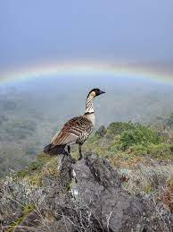
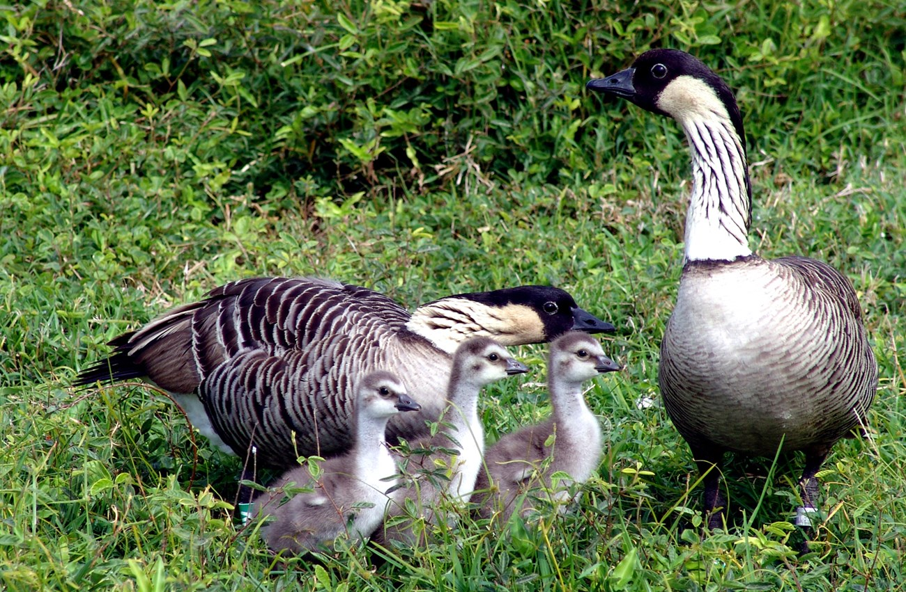

 Became Hawaii state bird in 1957

```{r setup, include=FALSE}
knitr::opts_chunk$set(echo = TRUE)
packages<-c("cowplot","dismo","leaflet","mapdata","rasterVis","rdryad","rgbif","sf","tidyverse")
sapply(packages, library, character.only=T)
```

```{r nene}
nene.rgbif <- occ_data(scientificName = "Branta sandvicensis",
                       hasCoordinate = TRUE, limit = 2000,
                       decimalLongitude = "-160, -155", 
                       decimalLatitude = "18, 23")

nene.rgbif.df <- cbind.data.frame(nene.rgbif$data$species,
                                  nene.rgbif$data$decimalLatitude,
                                  nene.rgbif$data$decimalLongitude,
                                  nene.rgbif$data$stateProvince,
                                  nene.rgbif$data$verbatimLocality)

colnames(nene.rgbif.df) <- c("species","y","x","state","location")
```

```{r plot}
us <- map_data("state")

ggplot() +
  geom_polygon(data = us, aes(x=long, y = lat, group = group),
               fill = "white", color="black") +
  geom_point(data = nene.rgbif.df, aes(x=x, y=y, color = species), size = 3) +
  coord_fixed(xlim = c(-160,-155), ylim = c(18,23)) +
  xlab("Longitude") + ylab("Latitude") + ggtitle("Nene") + 
  guides(color=guide_legend("Legend", override.aes = list(size = 4))) +
  theme_bw() + theme(plot.title = element_text(hjust = 0.5)) + 
  theme(legend.position = "bottom") +
  theme(legend.title.align = 0.5, legend.box.just = "center") +
  theme(panel.grid.major = element_blank(), 
        panel.grid.minor = element_blank(),
        panel.background = element_rect(fill = "lightblue"))
```

```{r}
leaflet(nene.rgbif.df) %>% 
  addTiles() %>% 
  addCircleMarkers(nene.rgbif.df$x,
                   nene.rgbif.df$y,
                   popup = nene.rgbif.df$species,
                   weight = 2,
                   fillOpacity = 0.7) %>%
  addMiniMap(position = 'topright',
             width = 100, 
             height = 100,
             toggleDisplay = FALSE) %>%
  addScaleBar(position = "bottomright")
```

```{r}
bioclim <- getData(name = "worldclim", res = 2.5, var = "bio", path = "./")

names(bioclim) <- c("Ann Mean Temp","Mean Diurnal Range","Isothermality","Temperature Seasonality",
                    "Max Temp Warmest Mo","Min Temp Coldest Mo","Ann Temp Range","Mean Temp Wettest Qtr",
                    "Mean Temp Driest Qtr","Mean Temp Warmest Qtr","Mean Temp Coldest Qtr","Annual
                    Precip","Precip Wettest Mo","Precip Driest Mo","Precip Seasonality","Precip Wettest
                    Qtr","Precip Driest Qtr","Precip Warmest Qtr","Precip Coldest Qtr")

bio.extent <- extent(x = c(
  min(nene.rgbif.df$x),
  max(nene.rgbif.df$x),
  min(nene.rgbif.df$y),
  max(nene.rgbif.df$y)))

bioclim.extent <- crop(x = bioclim, y = bio.extent)

bioclim.model <- bioclim(x = bioclim.extent, p = cbind(nene.rgbif.df$x,nene.rgbif.df$y))
presence.model <- dismo::predict(object = bioclim.model, 
                                 x = bioclim.extent, 
                                 ext = bio.extent)

rasterVis::gplot(presence.model) + 
  geom_polygon(data = us, aes(x= long, y = lat, group = group),
               fill = "gray", color="black") +
  geom_raster(aes(fill=value)) +
  geom_polygon(data = us, aes(x= long, y = lat, group = group),
               fill = NA, color="black") +
  geom_point(data = nene.rgbif.df, aes(x = x, y = y), size = 2, color = "black", alpha = 0.5) +
  scale_fill_gradientn(colours=c("brown","yellow","darkgreen"), "Probability") +
  coord_fixed(xlim = c(-160,-155), ylim = c(18,23)) +
  xlab("Longitude") + ylab("Latitude") + ggtitle("Probability of Nene in Hawaii") + 
  theme_bw() + theme(plot.title = element_text(hjust = 0.5)) + theme(legend.position = "right") +
  theme(panel.grid.major = element_blank(), 
        panel.grid.minor = element_blank(),
        panel.background = element_rect(fill = "lightblue"))

```



Nene call(<https://www.youtube.com/watch?v=5fPRKzNPjQQ&ab_channel=StrangeHawaii>)
